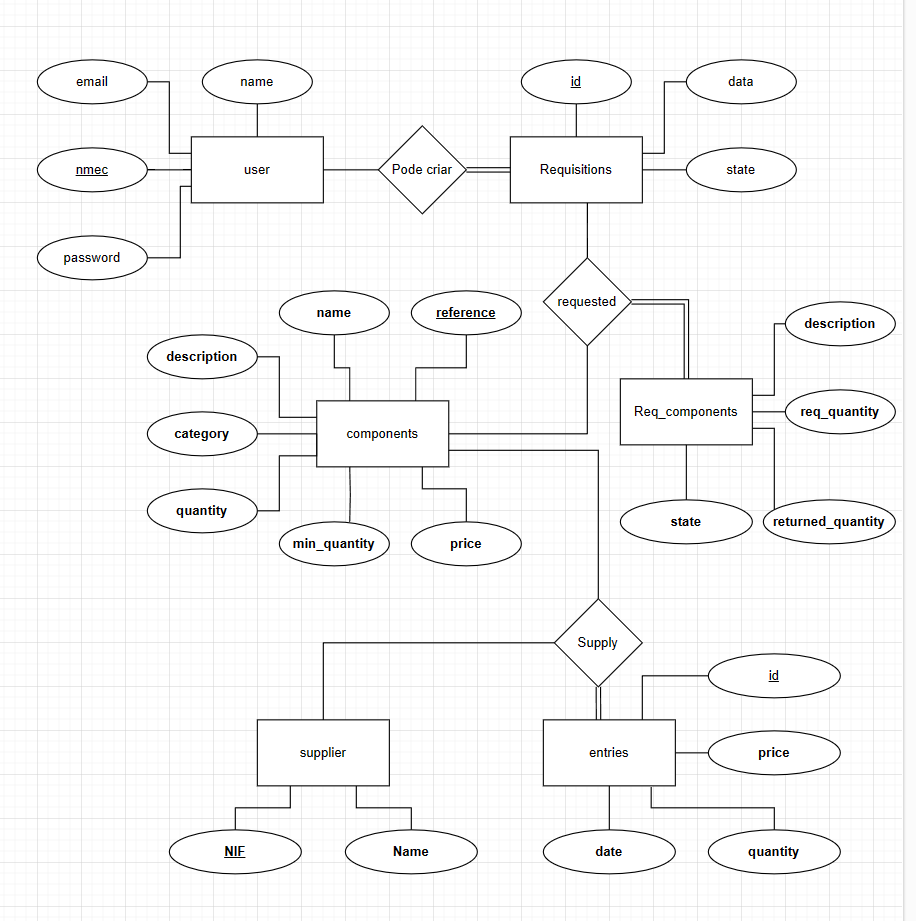
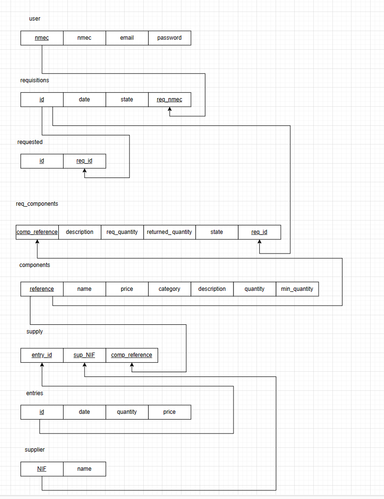

# BD: Trabalho Prático APFE

**Grupo**: P3G9
- Joaquim Andrade, MEC: 93432

## Introdução / Introduction

O projeto é uma modelação de uma base de dados para um armazém de componentes. Este projeto permite aos alunos vizualizar os componentes em stock e fazer uma requisição dos mesmos.
Daí para a frente é usada pelo administrador do armazém para gerir tanto as entradas de componentes, como os fornecedores, as requisições efetuadas.

## ​Análise de Requisitos / Requirements

- O utilizador tem de criar uma conta, registando-se com um e-mail, uma senha de acesso, n mec. e nome de utilizador.
- O utilizador tem um histórico com as requisições feitas.
- Existe uma lista de componentes com uma referência, categoria, um nome, quantidade, preço, quantidade mínima e descrição.
- Existe uma lista de requisições efetuadas pelos alunos com uma listagem de componentes por requisição, a data da requisição e o estado da requisição
- A requisição tem uma listagem de componentes com um estado, uma descrição (caso seja dado como perdido o componente a descrição explica porquê), a quantidade pedida e a quantidade devolvida.
- Uma listagem de fornecedores, com o NIF e o nome.
- Uma listagem de compras feitas aos fornecedores com o nif do fornecedor, a referencia do componente, o preço, a quantidade e a data de entrega.

## DER

## ER

